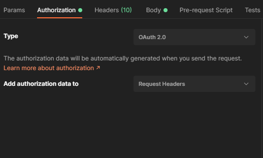
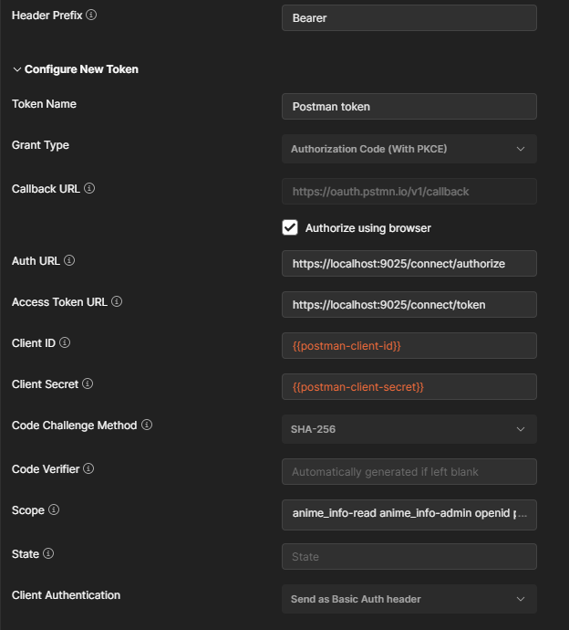

# Testing in Postman

## This guide contains information about how to setup your requests in Postman with Identity Server 4 to get working requests.

---

- Create a request in Postman.
- In the address bar write the right url.
- Go to the `Authorization` tab, right there select `OAuth 2.0` type
- In the `Add authorization data to` line select the `Request Headers` option.

---

In the right panel,
- Header Prefix: write `Bearer`
- Token name: anything you want
- Grant Type: select `Authorization Code (with PKCE)`
- Callback Url: Check in `Authorize using browser`
- Auth URL: your Identity Server's `authorization_endpoint`
    - After you set up Identity Server 4, open your Discovery Document/Endpoint and the `Auth URL` will be the `authorization_endpoint`
- Acces Token URL: your Identity Server's `token_endpoint`
    - After you set up Identity Server 4, open your Discovery Document/Endpoint and the `Acces Token URL` will be the `token_endpoint`
- Client ID: your client ID
    - After you set up Identity Server 4, you have to create a client for Postman.
    - This will be the created client's `Client ID` that you set up in Identity Server.
- Client Secret: your client secret
    - After you created a client for Postman in Identity Server, you have to add a secret to it.
    - This will be the created secret.
- Code Challenge Method: I left it at `SHA-256`
- Scope: All the API scopes that you want to get access to.
- Client Authentication: I left it at `Send as Basic Auth header`

This picture shows how I set up my `Anime Info create` request in Postman (in the picture the `Client ID` and `Client Secret` values are [variables](https://learning.postman.com/docs/sending-requests/variables/)). 

After you're done, click the `Get New Acces Token` button. It will open a new browser tab.
- If this is your first time then you will see the consent screen. It will ask for permissions (i.e: your user id, roles, genre permissions, admin permissions, etc.).
- After you accept it, you have to choose what program should open the link. Select Postman.
- Postman will pop up and hopefully can receive the token.

At Identity Server, Allow Access Token Via Browser for this client and set the Redirect Uri to what you see at `Callback URL`.